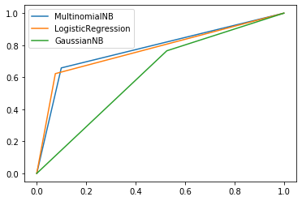
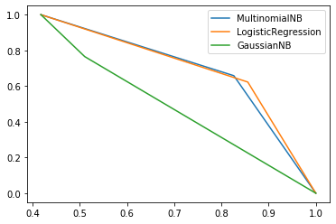

```python
# This Python 3 environment comes with many helpful analytics libraries installed
# It is defined by the kaggle/python docker image: https://github.com/kaggle/docker-python
# For example, here's several helpful packages to load in 

import numpy as np # linear algebra
import pandas as pd # data processing, CSV file I/O (e.g. pd.read_csv)

# Input data files are available in the "../input/" directory.
# For example, running this (by clicking run or pressing Shift+Enter) will list all files under the input directory

import os
#for dirname, _, filenames in os.walk('/kaggle/input'):
#    for filename in filenames:
#        print(os.path.join(dirname, filename))

# Any results you write to the current directory are saved as output.
```

# 1. Importing Libraries


```python
!pip install pyspellchecker
```

    Collecting pyspellchecker
      Downloading pyspellchecker-0.5.4-py2.py3-none-any.whl (1.9 MB)
    Installing collected packages: pyspellchecker
    Successfully installed pyspellchecker-0.5.4
    


```python
import numpy as np
import pandas as pd
import tensorflow as tf
import nltk
#import keras
import os
import seaborn as sns
import matplotlib.pyplot as plt
from nltk import word_tokenize
from nltk import clean_html
import re
import string
from nltk.corpus import stopwords
from bs4 import BeautifulSoup
from spellchecker import SpellChecker
from nltk import WordNetLemmatizer
from sklearn.feature_extraction.text import TfidfVectorizer
from sklearn.model_selection import train_test_split
```

# 2. Loading Data


```python
dataTrain = pd.read_csv('train.csv') 
```

# 3. Understanding Data


```python
dataTrain.head()
```


<div>
<style scoped>
    .dataframe tbody tr th:only-of-type {
        vertical-align: middle;
    }

    .dataframe tbody tr th {
        vertical-align: top;
    }

    .dataframe thead th {
        text-align: right;
    }
</style>
<table border="1" class="dataframe">
  <thead>
    <tr style="text-align: right;">
      <th></th>
      <th>id</th>
      <th>keyword</th>
      <th>location</th>
      <th>text</th>
      <th>target</th>
    </tr>
  </thead>
  <tbody>
    <tr>
      <th>0</th>
      <td>1</td>
      <td>NaN</td>
      <td>NaN</td>
      <td>Our Deeds are the Reason of this #earthquake M...</td>
      <td>1</td>
    </tr>
    <tr>
      <th>1</th>
      <td>4</td>
      <td>NaN</td>
      <td>NaN</td>
      <td>Forest fire near La Ronge Sask. Canada</td>
      <td>1</td>
    </tr>
    <tr>
      <th>2</th>
      <td>5</td>
      <td>NaN</td>
      <td>NaN</td>
      <td>All residents asked to 'shelter in place' are ...</td>
      <td>1</td>
    </tr>
    <tr>
      <th>3</th>
      <td>6</td>
      <td>NaN</td>
      <td>NaN</td>
      <td>13,000 people receive #wildfires evacuation or...</td>
      <td>1</td>
    </tr>
    <tr>
      <th>4</th>
      <td>7</td>
      <td>NaN</td>
      <td>NaN</td>
      <td>Just got sent this photo from Ruby #Alaska as ...</td>
      <td>1</td>
    </tr>
  </tbody>
</table>
</div>


```python
dataTrain.info()
```

    <class 'pandas.core.frame.DataFrame'>
    RangeIndex: 7613 entries, 0 to 7612
    Data columns (total 5 columns):
     #   Column    Non-Null Count  Dtype 
    ---  ------    --------------  ----- 
     0   id        7613 non-null   int64 
     1   keyword   7552 non-null   object
     2   location  5080 non-null   object
     3   text      7613 non-null   object
     4   target    7613 non-null   int64 
    dtypes: int64(2), object(3)
    memory usage: 297.5+ KB
    


```python
for col in dataTrain.columns:
    print(col+ ' - ' + format(dataTrain[col].isnull().sum()))
```

    id - 0
    keyword - 61
    location - 2533
    text - 0
    target - 0
    


```python
dataTrain.drop(['id','keyword','location'],inplace=True,axis=1)
dataTrain.head()
```


<div>
<style scoped>
    .dataframe tbody tr th:only-of-type {
        vertical-align: middle;
    }

    .dataframe tbody tr th {
        vertical-align: top;
    }

    .dataframe thead th {
        text-align: right;
    }
</style>
<table border="1" class="dataframe">
  <thead>
    <tr style="text-align: right;">
      <th></th>
      <th>text</th>
      <th>target</th>
    </tr>
  </thead>
  <tbody>
    <tr>
      <th>0</th>
      <td>Our Deeds are the Reason of this #earthquake M...</td>
      <td>1</td>
    </tr>
    <tr>
      <th>1</th>
      <td>Forest fire near La Ronge Sask. Canada</td>
      <td>1</td>
    </tr>
    <tr>
      <th>2</th>
      <td>All residents asked to 'shelter in place' are ...</td>
      <td>1</td>
    </tr>
    <tr>
      <th>3</th>
      <td>13,000 people receive #wildfires evacuation or...</td>
      <td>1</td>
    </tr>
    <tr>
      <th>4</th>
      <td>Just got sent this photo from Ruby #Alaska as ...</td>
      <td>1</td>
    </tr>
  </tbody>
</table>
</div>


# 4. Data Cleaning

## converting text to tokens of word


```python

#data
```


```python
def remove_html(w):
    soup = BeautifulSoup(w)
    text = soup.get_text()
    return w
```


```python
def remove_url(text):
    # remove urls
    url = re.compile(r'https?://\S+|www\.\S+')
    return url.sub(r'',text)
```


```python
def remove_emoji(text):
    emoji_pattern = re.compile("["
                           u"\U0001F600-\U0001F64F"  # emoticons
                           u"\U0001F300-\U0001F5FF"  # symbols & pictographs
                           u"\U0001F680-\U0001F6FF"  # transport & map symbols
                           u"\U0001F1E0-\U0001F1FF"  # flags (iOS)
                           u"\U00002702-\U000027B0"
                           u"\U000024C2-\U0001F251"
                           "]+", flags=re.UNICODE)
    return emoji_pattern.sub(r'', text)
```


```python
spell = SpellChecker()
def correct_spellings(text):
    corrected_text = []
    misspelled_words = spell.unknown(text.split())
    for word in text.split():
        if word in misspelled_words:
            corrected_text.append(spell.correction(word))
        else:
            corrected_text.append(word)
    return " ".join(corrected_text)
```


```python
def cleanData(data):
    # remove urls
    data['text'] = data['text'].apply(lambda x:remove_url(x))
    print('urls removed')
    
    # remove emojis
    data['text'] = data['text'].apply(lambda x:remove_emoji(x))
    print('emojis removed')
    # correct spellings
    # commenting this out because this takes very long
    #data['text'] = data['text'].apply(lambda x:correct_spellings(x))
    
    # tokenizing words
    data['text'] = data['text'].apply(lambda x:word_tokenize(x))
    print('tokenization done')
    
    # convert all text to lowercase
    data['text'] = data['text'].apply(lambda x:[w.lower() for w in x ])
    print('lowercase done')
    
    # remove html tags
    data['text'] = data['text'].apply(lambda x:[remove_html(w) for w in x])
    print('html tags removed')
    
    # prepare regex for char filtering
    re_punc = re.compile('[%s]' % re.escape(string.punctuation))
    
    
    # removing puncutations
    data['text'] = data['text'].apply(lambda x:[re_punc.sub('',w) for w in x])
    print('punctuations removed')
    
    # removing non alphabetic words 
    data['text'] = data['text'].apply(lambda x:[w for w in x if w.isalpha()])
    print('numeric removed')
    
    # removing stopwords
    data['text'] = data['text'].apply(lambda x:[w for w in x if w not in stopwords.words('english')])
    print('stopwords removed')
    
    # removing short words
    data['text'] = data['text'].apply(lambda x:[w for w in x if len(w)>2])
    print('shortwords removed')
    
    return data
```


```python
backup = dataTrain.copy()
```


```python
dataTrain = backup
```


```python
#data = pd.DataFrame(['How 123 are you doing Today major qr ?is this corect','fine thank you <b>colonel</b>! https://www.kaggle.com/c/nlp-getting-started'],columns=['text'])
data = cleanData(dataTrain)
```

    urls removed
    emojis removed
    tokenization done
    lowercase done
    

    C:\Users\daisycharlie\Anaconda3\envs\tf2\lib\site-packages\bs4\__init__.py:314: UserWarning: "b'.'" looks like a filename, not markup. You should probably open this file and pass the filehandle into Beautiful Soup.
      ' Beautiful Soup.' % markup)
    C:\Users\daisycharlie\Anaconda3\envs\tf2\lib\site-packages\bs4\__init__.py:314: UserWarning: "b'...'" looks like a filename, not markup. You should probably open this file and pass the filehandle into Beautiful Soup.
      ' Beautiful Soup.' % markup)
    C:\Users\daisycharlie\Anaconda3\envs\tf2\lib\site-packages\bs4\__init__.py:314: UserWarning: "b'..'" looks like a filename, not markup. You should probably open this file and pass the filehandle into Beautiful Soup.
      ' Beautiful Soup.' % markup)
    C:\Users\daisycharlie\Anaconda3\envs\tf2\lib\site-packages\bs4\__init__.py:314: UserWarning: "b'/'" looks like a filename, not markup. You should probably open this file and pass the filehandle into Beautiful Soup.
      ' Beautiful Soup.' % markup)
    C:\Users\daisycharlie\Anaconda3\envs\tf2\lib\site-packages\bs4\__init__.py:314: UserWarning: "b'model'" looks like a filename, not markup. You should probably open this file and pass the filehandle into Beautiful Soup.
      ' Beautiful Soup.' % markup)
    C:\Users\daisycharlie\Anaconda3\envs\tf2\lib\site-packages\bs4\__init__.py:314: UserWarning: "b'./'" looks like a filename, not markup. You should probably open this file and pass the filehandle into Beautiful Soup.
      ' Beautiful Soup.' % markup)
    

    html tags removed
    punctuations removed
    numeric removed
    stopwords removed
    shortwords removed
    


```python
dataTrain.head()
```


<div>
<style scoped>
    .dataframe tbody tr th:only-of-type {
        vertical-align: middle;
    }

    .dataframe tbody tr th {
        vertical-align: top;
    }

    .dataframe thead th {
        text-align: right;
    }
</style>
<table border="1" class="dataframe">
  <thead>
    <tr style="text-align: right;">
      <th></th>
      <th>text</th>
      <th>target</th>
    </tr>
  </thead>
  <tbody>
    <tr>
      <th>0</th>
      <td>[deeds, reason, earthquake, may, allah, forgive]</td>
      <td>1</td>
    </tr>
    <tr>
      <th>1</th>
      <td>[forest, fire, near, ronge, sask, canada]</td>
      <td>1</td>
    </tr>
    <tr>
      <th>2</th>
      <td>[residents, asked, shelter, place, notified, o...</td>
      <td>1</td>
    </tr>
    <tr>
      <th>3</th>
      <td>[people, receive, wildfires, evacuation, order...</td>
      <td>1</td>
    </tr>
    <tr>
      <th>4</th>
      <td>[got, sent, photo, ruby, alaska, smoke, wildfi...</td>
      <td>1</td>
    </tr>
  </tbody>
</table>
</div>


```python
#dataTrain.drop(['keyword','location'],inplace=True,axis=1)
#dataTrain.head()
```


```python
#dataTrain.drop(['id'],inplace=True,axis=1)
#dataTrain.head()
```

lematize data


```python
backup = dataTrain.copy()
```


```python
dataTrain = backup
dataTrain.head()
```


<div>
<style scoped>
    .dataframe tbody tr th:only-of-type {
        vertical-align: middle;
    }

    .dataframe tbody tr th {
        vertical-align: top;
    }

    .dataframe thead th {
        text-align: right;
    }
</style>
<table border="1" class="dataframe">
  <thead>
    <tr style="text-align: right;">
      <th></th>
      <th>text</th>
      <th>target</th>
    </tr>
  </thead>
  <tbody>
    <tr>
      <th>0</th>
      <td>[deeds, reason, earthquake, may, allah, forgive]</td>
      <td>1</td>
    </tr>
    <tr>
      <th>1</th>
      <td>[forest, fire, near, ronge, sask, canada]</td>
      <td>1</td>
    </tr>
    <tr>
      <th>2</th>
      <td>[residents, asked, shelter, place, notified, o...</td>
      <td>1</td>
    </tr>
    <tr>
      <th>3</th>
      <td>[people, receive, wildfires, evacuation, order...</td>
      <td>1</td>
    </tr>
    <tr>
      <th>4</th>
      <td>[got, sent, photo, ruby, alaska, smoke, wildfi...</td>
      <td>1</td>
    </tr>
  </tbody>
</table>
</div>


```python
lem = WordNetLemmatizer()
dataTrain['text'] = dataTrain['text'].apply(lambda x:[lem.lemmatize(w) for w in x])
```


```python
# join text
dataTrain['text'] = dataTrain['text'].apply(lambda x:' '.join(x))
```


```python
dataTrain.sample(5)
```


<div>
<style scoped>
    .dataframe tbody tr th:only-of-type {
        vertical-align: middle;
    }

    .dataframe tbody tr th {
        vertical-align: top;
    }

    .dataframe thead th {
        text-align: right;
    }
</style>
<table border="1" class="dataframe">
  <thead>
    <tr style="text-align: right;">
      <th></th>
      <th>text</th>
      <th>target</th>
    </tr>
  </thead>
  <tbody>
    <tr>
      <th>3769</th>
      <td>word charlie daniel fire mountain run boy run</td>
      <td>1</td>
    </tr>
    <tr>
      <th>1497</th>
      <td>learning legacy catastrophic eruption</td>
      <td>1</td>
    </tr>
    <tr>
      <th>3704</th>
      <td>want hurt fear drove midnight</td>
      <td>0</td>
    </tr>
    <tr>
      <th>4839</th>
      <td>mnpdnashville montalbanony sadly suicide cop w...</td>
      <td>1</td>
    </tr>
    <tr>
      <th>283</th>
      <td>apocalypse upon</td>
      <td>0</td>
    </tr>
  </tbody>
</table>
</div>


# Modelling

## using scikit learn


```python
X = dataTrain['text']
Y = dataTrain['target']
```


```python
tfidf = TfidfVectorizer()
tfidfFit = tfidf.fit(X)
X = tfidf.transform(X)
```


```python
import pickle
```


```python

pkl_Filename = "tfidfFit"

with open(pkl_Filename, 'wb') as file:
    pickle.dump(tfidfFit,file)
```


```python
X = X.toarray()
```


```python
x_train,x_test,y_train,y_test = train_test_split(X,Y,test_size=.15)
```


```python
from sklearn.linear_model import LogisticRegression
from sklearn.metrics import confusion_matrix
from sklearn.metrics import precision_recall_curve
from sklearn.metrics import classification_report
from sklearn.metrics import roc_curve
from sklearn.metrics import r2_score
from sklearn.metrics import precision_score,recall_score
from sklearn.metrics import f1_score
from sklearn.svm import SVC
from sklearn.naive_bayes import GaussianNB
from sklearn.tree import DecisionTreeClassifier
from sklearn.ensemble import RandomForestClassifier
from sklearn.neighbors import KNeighborsClassifier
from sklearn.model_selection import GridSearchCV, cross_val_score,StratifiedKFold, learning_curve
```


```python
conMatList = []
prcList = []
clRep= []
rocDet = []
preScore = []
recScore = []
f1Score = []
yPred = []

def getClassModel(model):
    model = model()
    model_name = model.__class__.__name__
    model.fit(x_train,y_train)
    
    #getting prediction
    y_pred = model.predict(x_test)
    yPred.append([model_name,y_pred])
    
    # getting scores
    
    pre_score = precision_score(y_test,y_pred)
    rec_score= recall_score(y_test,y_pred)
    f1score = f1_score(y_test,y_pred)
    
    preScore.append([model_name,pre_score])
    recScore.append([model_name,rec_score])
    f1Score.append([model_name,f1score])
    
    ## getting confusion matrix
    cm = confusion_matrix(y_test,y_pred)
    matrix = pd.DataFrame(cm,columns=['predicted 0','predicted 1'],
                         index=['Actual 0','Actual 1'])
    conMatList.append([model_name,matrix])
    
     ## getting precision recall curve values
    
    precision, recall, thresholds = precision_recall_curve(y_test,y_pred)
    prcList.append([model_name,precision,recall,thresholds])
    
    ## roc details
    
    fpr,tpr,thresholds = roc_curve(y_test,y_pred)
    rocDet.append([model_name,fpr,tpr,thresholds])
    
    ## classification report
    
    classRep = classification_report(y_test,y_pred)
    clRep.append([model_name,classRep])
```


```python
from sklearn.naive_bayes import MultinomialNB
```


```python
kfold = StratifiedKFold(n_splits=10)
#classModelList = [LogisticRegression,SVC,GaussianNB,DecisionTreeClassifier
#                 ,RandomForestClassifier,KNeighborsClassifier]
classModelList = [MultinomialNB,LogisticRegression,GaussianNB]
i = 0
for model in classModelList:
    
    getClassModel(model)
    print(i)
    i = i+1
```

    0
    1
    2
    


```python
#getting cross validation scores for each model
cv_results = []
for model in classModelList:
    cv_results.append(cross_val_score(model(),x_train,y_train,scoring='accuracy',
                                     cv=kfold,n_jobs=4))
cv_means = []
cv_std = []

for cv_result in cv_results:
    cv_means.append(cv_result.mean())
    cv_std.append(cv_result.std())
    
model_name = []
for model in classModelList:
    modelIns = model()
    model_name.append(modelIns.__class__.__name__)
    
cv_res = pd.DataFrame({
    "CrossValMeans":cv_means,
    "CrossValErrors":cv_std,
    "Model":model_name
})
  
cv_res
```


<div>
<style scoped>
    .dataframe tbody tr th:only-of-type {
        vertical-align: middle;
    }

    .dataframe tbody tr th {
        vertical-align: top;
    }

    .dataframe thead th {
        text-align: right;
    }
</style>
<table border="1" class="dataframe">
  <thead>
    <tr style="text-align: right;">
      <th></th>
      <th>CrossValMeans</th>
      <th>CrossValErrors</th>
      <th>Model</th>
    </tr>
  </thead>
  <tbody>
    <tr>
      <th>0</th>
      <td>0.802968</td>
      <td>0.011919</td>
      <td>MultinomialNB</td>
    </tr>
    <tr>
      <th>1</th>
      <td>0.800805</td>
      <td>0.010239</td>
      <td>LogisticRegression</td>
    </tr>
    <tr>
      <th>2</th>
      <td>0.610724</td>
      <td>0.010305</td>
      <td>GaussianNB</td>
    </tr>
  </tbody>
</table>
</div>


```python
for mat in conMatList:
    print(mat[0])
    print(' ')
    print(mat[1])
    print('-----------------------------------------------')
```

    MultinomialNB
     
              predicted 0  predicted 1
    Actual 0          599           66
    Actual 1          163          314
    -----------------------------------------------
    LogisticRegression
     
              predicted 0  predicted 1
    Actual 0          615           50
    Actual 1          180          297
    -----------------------------------------------
    GaussianNB
     
              predicted 0  predicted 1
    Actual 0          315          350
    Actual 1          112          365
    -----------------------------------------------
    


```python
precisionDf = pd.DataFrame(preScore,columns=['model','precisionScore'])
recallDf = pd.DataFrame(recScore,columns=['model','recallScore'])
f1Df = pd.DataFrame(f1Score,columns=['model','f1Score'])
precisionDf['f1Score'] = f1Df['f1Score']
precisionDf['recallScore'] = recallDf['recallScore']
precisionDf
```


<div>
<style scoped>
    .dataframe tbody tr th:only-of-type {
        vertical-align: middle;
    }

    .dataframe tbody tr th {
        vertical-align: top;
    }

    .dataframe thead th {
        text-align: right;
    }
</style>
<table border="1" class="dataframe">
  <thead>
    <tr style="text-align: right;">
      <th></th>
      <th>model</th>
      <th>precisionScore</th>
      <th>f1Score</th>
      <th>recallScore</th>
    </tr>
  </thead>
  <tbody>
    <tr>
      <th>0</th>
      <td>MultinomialNB</td>
      <td>0.826316</td>
      <td>0.732789</td>
      <td>0.658281</td>
    </tr>
    <tr>
      <th>1</th>
      <td>LogisticRegression</td>
      <td>0.855908</td>
      <td>0.720874</td>
      <td>0.622642</td>
    </tr>
    <tr>
      <th>2</th>
      <td>GaussianNB</td>
      <td>0.510490</td>
      <td>0.612416</td>
      <td>0.765199</td>
    </tr>
  </tbody>
</table>
</div>


```python
for roc in rocDet:
    print(roc[0])
    fpr = roc[1]
    tpr = roc[2]
    plt.plot(fpr,tpr,label=roc[0])
    plt.legend()
```

    MultinomialNB
    LogisticRegression
    GaussianNB
    





```python
for prc in prcList:
    precision = prc[1]
    recall = prc[2]
    plt.plot(precision,recall,label=prc[0])
    plt.legend()
```





# Finalising algorithms and saving models


```python
logreg = LogisticRegression()
logreg.fit(x_train,y_train)
```


    LogisticRegression(C=1.0, class_weight=None, dual=False, fit_intercept=True,
                       intercept_scaling=1, l1_ratio=None, max_iter=100,
                       multi_class='auto', n_jobs=None, penalty='l2',
                       random_state=None, solver='lbfgs', tol=0.0001, verbose=0,
                       warm_start=False)


```python
import pickle
pkl_Filename = "regModel"

with open(pkl_Filename, 'wb') as file:
    pickle.dump(logreg,file)
```


```python

from IPython.display import FileLink
FileLink('regModel.pkl')
```


```python
#cheking if model saved works
with open(pkl_Filename, 'rb') as file: 
    print(file)
    Pickled_LR_Model = pickle.load(file)
```


```python
ty = x_train[2]
```


```python
y_pred = Pickled_LR_Model.predict(np.reshape(ty,(1,ty.shape[0])))
y_pred
```


```python
y_train[:3]
```

## Function to preprocess test data


```python
dataTrial = pd.DataFrame(['several casualties as death result in millions'],columns = ['text'])
dataTrial = cleanData(dataTrial)
```


```python
dataTrial['text'] = dataTrial['text'].apply(lambda x:[lem.lemmatize(w) for w in x])
dataTrial['text'] = dataTrial['text'].apply(lambda x:' '.join(x))
```


```python
Xtest = dataTrial['text']
Xtest = tfidf.transform(Xtest)
```


```python
Xtest = Xtest.toarray()
```


```python
Xtest.shape
```


```python
y_pred = Pickled_LR_Model.predict(Xtest)
y_pred
```


```python
ty.shape[0]
```


```python
ty = np.reshape(ty,(1,ty.shape[0]))
```


```python
ty.shape
```


```python

```
